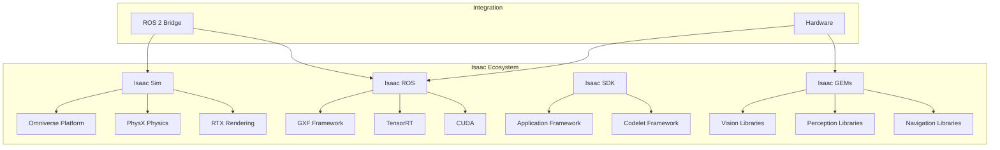

# 3.1.1 Overview of NVIDIA Isaac™ Platform

## Introduction

NVIDIA Isaac™ represents a comprehensive robotics platform that combines advanced simulation, perception, and navigation capabilities to accelerate the development of autonomous robots. Built on NVIDIA's powerful GPU computing platform, Isaac™ provides developers with the tools needed to create sophisticated robotic applications, particularly in the realm of humanoid robotics where perception and navigation are critical.

The platform addresses key challenges in robotics development by providing photorealistic simulation environments, hardware-accelerated perception algorithms, and robust navigation systems. For humanoid robots specifically, Isaac™ offers the computational power and simulation fidelity needed to develop complex behaviors in a safe, controlled environment before deployment on physical hardware.

## History and Evolution of Isaac™

NVIDIA's journey into robotics began with its focus on GPU-accelerated computing, which naturally evolved into specialized robotics solutions. The Isaac™ platform has undergone significant evolution since its inception, with each iteration bringing more sophisticated capabilities and broader applications.

- **2018**: Initial announcement of NVIDIA Isaac™ platform at GTC, focusing on the integration of AI and robotics with NVIDIA's GPU computing platform
- **2019**: Introduction of Isaac Sim (initially called Isaac Gym) for reinforcement learning and physics simulation
- **2020**: Isaac Sim 1.0 released, featuring photorealistic rendering and comprehensive robot simulation capabilities
- **2021**: Isaac ROS (Robotics Operating System) packages introduced, providing hardware-accelerated perception and navigation algorithms
- **2022**: Isaac ROS 2.0 launched with support for ROS 2 Humble Hawksbill, enhanced perception pipelines, and improved integration with Isaac Sim
- **2023**: Isaac Lab introduced, providing advanced simulation environments for complex manipulation and locomotion tasks
- **2024-2025**: Continued expansion with Isaac ROS 3.0, enhanced support for humanoid robots, and improved sim-to-real transfer capabilities

This evolution reflects NVIDIA's commitment to addressing the growing complexity of modern robotics applications, particularly in areas requiring real-time perception and decision-making capabilities.

## Isaac™ Ecosystem Components

The NVIDIA Isaac™ ecosystem comprises several interconnected components that work together to provide a comprehensive solution for robotics development. Each component addresses specific aspects of the robotics pipeline, from simulation to deployment.

### Isaac Sim

Isaac Sim is NVIDIA's flagship simulation environment built on the Omniverse platform. It provides photorealistic rendering capabilities using RTX ray tracing technology, enabling developers to create simulation environments that closely match real-world conditions. This photorealism is crucial for generating synthetic data that can be effectively transferred to real-world applications.

Key features of Isaac Sim include:
- **USD-based scene description**: Universal Scene Description (USD) provides a scalable and extensible format for complex scene representation
- **PhysX physics engine**: NVIDIA's PhysX engine delivers accurate physics simulation with support for rigid body dynamics, soft body simulation, and fluid dynamics
- **Multi-sensor simulation**: Comprehensive support for cameras, LiDAR, IMU, GPS, and other sensors with realistic noise models
- **Real-time rendering**: RTX-accelerated rendering enables interactive simulation with high-fidelity visuals
- **ROS 2 integration**: Native integration with ROS 2 allows seamless communication between simulation and robotics applications
- **Extension framework**: Python and C++ APIs enable customization and extension of simulation capabilities

Isaac Sim excels in creating complex environments for training and testing robotic systems, particularly in scenarios where real-world testing would be dangerous, expensive, or time-consuming.

### Isaac ROS

Isaac ROS represents NVIDIA's collection of hardware-accelerated ROS 2 packages designed to leverage GPU computing for robotics perception and navigation tasks. These packages implement the Graph Execution Framework (GXF) to provide efficient, low-latency processing of sensor data.

Key Isaac ROS packages include:
- **isaac_ros_image_pipeline**: Optimized image processing pipeline with hardware acceleration
- **isaac_ros_dnn_inference**: Deep neural network inference with TensorRT optimization
- **isaac_ros_visual_slam**: Hardware-accelerated visual SLAM for real-time mapping and localization
- **isaac_ros_pose_estimation**: Human pose estimation and tracking
- **isaac_ros_apriltag**: GPU-accelerated AprilTag detection and pose estimation
- **isaac_ros_depth_segmentation**: Real-time depth and semantic segmentation

These packages are designed to work seamlessly with traditional ROS 2 nodes while providing significant performance improvements through GPU acceleration. The use of GXF ensures efficient memory management and minimal data copying between processing stages.

### Isaac SDK

The Isaac SDK provides a comprehensive set of tools and libraries for developing robotics applications using NVIDIA's GPU computing platform. It includes both high-level APIs for rapid development and low-level libraries for maximum performance.

Key components of the Isaac SDK include:
- **Application framework**: Tools for building and managing robotics applications
- **Codelet framework**: Lightweight components for implementing specific functionality
- **Message passing**: Efficient communication between components
- **Logging and debugging**: Comprehensive tools for application development and debugging
- **Hardware abstraction**: APIs that abstract hardware-specific details while maximizing performance

The SDK is designed to work with both Isaac Sim and real hardware, enabling seamless transition from simulation to deployment.

### Isaac GEMs

Isaac GEMs (GPU-accelerated Embedded Machine Learning libraries) are specialized libraries that provide optimized implementations of common robotics algorithms. These libraries are specifically designed to leverage NVIDIA GPU architectures for maximum performance in embedded and edge computing scenarios.

Key Isaac GEMs include:
- **Vision libraries**: Optimized implementations of computer vision algorithms
- **Perception libraries**: GPU-accelerated object detection, tracking, and recognition
- **Navigation libraries**: Optimized path planning and control algorithms
- **Manipulation libraries**: Algorithms for robotic manipulation tasks
- **SLAM libraries**: GPU-accelerated simultaneous localization and mapping

These libraries are designed to provide maximum performance while maintaining compatibility with standard robotics frameworks and protocols.

## Integration with ROS 2 and Other Frameworks

The NVIDIA Isaac™ platform is designed with strong integration capabilities, particularly with ROS 2, which remains the dominant middleware framework in robotics. This integration is achieved through several mechanisms that preserve the ROS 2 ecosystem while adding NVIDIA's GPU acceleration capabilities.

### ROS 2 Bridge Architecture

The ROS 2 bridge in Isaac Sim enables seamless communication between simulation and ROS 2 nodes. This bridge handles:
- **Topic and service communication**: Transparent forwarding of ROS 2 messages between simulation and external nodes
- **Clock synchronization**: Proper time management between simulation and real-time systems
- **TF tree management**: Consistent transform representation between simulation and reality
- **Message type compatibility**: Automatic conversion between Isaac Sim and ROS 2 message formats

### CUDA Integration

NVIDIA's CUDA platform provides the foundation for GPU acceleration throughout the Isaac ecosystem. CUDA integration includes:
- **Direct GPU memory access**: Efficient data transfer between CPU and GPU memory spaces
- **TensorRT optimization**: Automatic optimization of neural networks for inference
- **Custom CUDA kernels**: Support for user-defined GPU-accelerated algorithms
- **Multi-GPU support**: Efficient utilization of multiple GPUs in single applications

### Omniverse Integration

The integration with NVIDIA Omniverse provides Isaac Sim with advanced 3D content creation and collaboration capabilities:
- **USD support**: Universal Scene Description format enables compatibility with professional 3D tools
- **Real-time collaboration**: Multiple users can work together in the same simulation environment
- **Asset management**: Comprehensive tools for managing 3D assets and scenes
- **Rendering pipeline**: RTX-accelerated rendering for photorealistic simulation

### Third-party Tool Compatibility

Isaac™ maintains compatibility with various third-party tools and frameworks:
- **Python and C++ APIs**: Support for the most common robotics development languages
- **Standard robotics formats**: Compatibility with URDF, SDF, and other standard formats
- **Machine learning frameworks**: Integration with TensorFlow, PyTorch, and other ML frameworks
- **Simulation formats**: Support for importing assets from other simulation platforms

## Use Cases in Humanoid Robotics

The NVIDIA Isaac™ platform is particularly well-suited for humanoid robotics applications, where complex perception, navigation, and interaction capabilities are required. Several key use cases demonstrate the platform's capabilities:

### 1. Warehouse Automation Humanoid

In warehouse environments, humanoid robots can perform complex tasks that require dexterity and decision-making capabilities. Isaac™ enables the development of such systems by providing:
- Photorealistic warehouse simulation environments for training
- Hardware-accelerated perception for object recognition and tracking
- Advanced navigation capabilities for complex indoor environments
- Human-robot interaction simulation for collaborative work

### 2. Healthcare Assistant Robot

Healthcare applications require robots that can safely interact with humans and perform delicate tasks. Isaac™ supports this through:
- Simulation of healthcare environments with realistic physics
- Advanced perception for patient monitoring and assistance
- Safe navigation in sensitive environments
- Human pose estimation for interaction and safety

### 3. Search and Rescue Humanoid

Search and rescue operations require robots that can navigate challenging environments and make autonomous decisions. Isaac™ enables:
- Simulation of disaster scenarios with complex physics
- Robust perception systems for low-visibility conditions
- Advanced navigation in unstructured environments
- Multi-sensor fusion for reliable operation

### 4. Manufacturing Collaborative Robot

In manufacturing, humanoid robots can work alongside humans in complex assembly tasks. Isaac™ supports:
- Simulation of manufacturing environments with precision requirements
- Advanced manipulation capabilities with dexterity
- Safe human-robot collaboration protocols
- Quality inspection and quality control systems

### 5. Service Robot in Hospitality

Hospitality applications require robots that can interact naturally with humans in dynamic environments. Isaac™ enables:
- Simulation of dynamic environments with moving humans
- Advanced perception for navigation in crowded spaces
- Natural human-robot interaction capabilities
- Task management and scheduling systems

## Conclusion

The NVIDIA Isaac™ platform represents a significant advancement in robotics development, particularly for complex applications like humanoid robotics. By combining photorealistic simulation, hardware-accelerated perception, and robust navigation capabilities, Isaac™ enables developers to create sophisticated robotic systems with confidence in their real-world performance. The platform's strong integration with ROS 2 and other frameworks ensures compatibility with existing robotics ecosystems while providing the performance advantages of GPU computing.

## Diagrams

### Mermaid: Isaac™ Ecosystem Architecture



### Comparison Table: Isaac™ vs Other Simulation Platforms

| Feature | Isaac Sim | Gazebo | Webots | PyBullet |
|---------|-----------|---------|---------|----------|
| Rendering Quality | Photorealistic (RTX) | Good | Good | Basic |
| Physics Engine | PhysX | ODE, Bullet | Custom | Bullet |
| GPU Acceleration | Yes (CUDA, TensorRT) | Limited | Limited | Limited |
| USD Support | Native | No | No | No |
| ROS 2 Integration | Excellent | Good | Good | Good |
| Real-time Performance | Excellent | Good | Good | Good |
| Synthetic Data Generation | Advanced | Basic | Basic | Basic |
| AI/ML Integration | Excellent | Good | Good | Good |

### Timeline Infographic

```
2018: Isaac Platform Announced
  ↓
2020: Isaac Sim 1.0 (Photorealistic Simulation)
  ↓
2022: Isaac ROS (Hardware-Accelerated Perception)
  ↓
2024: Isaac 3.0 (Enhanced Humanoid Support)
  ↓
2025: Current State (Sim-to-Real Transfer)
```