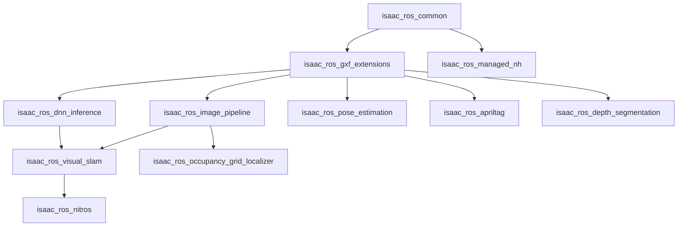
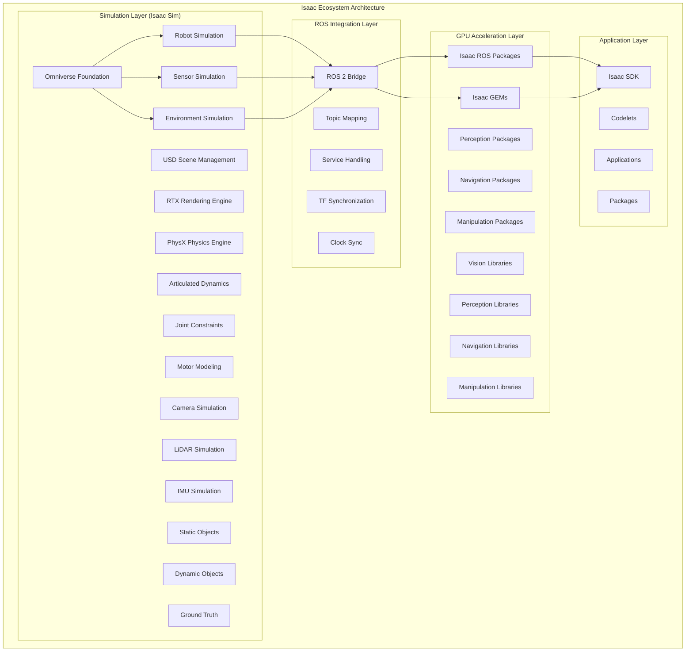
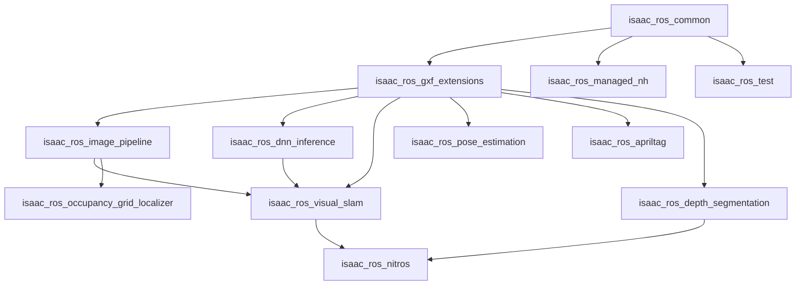
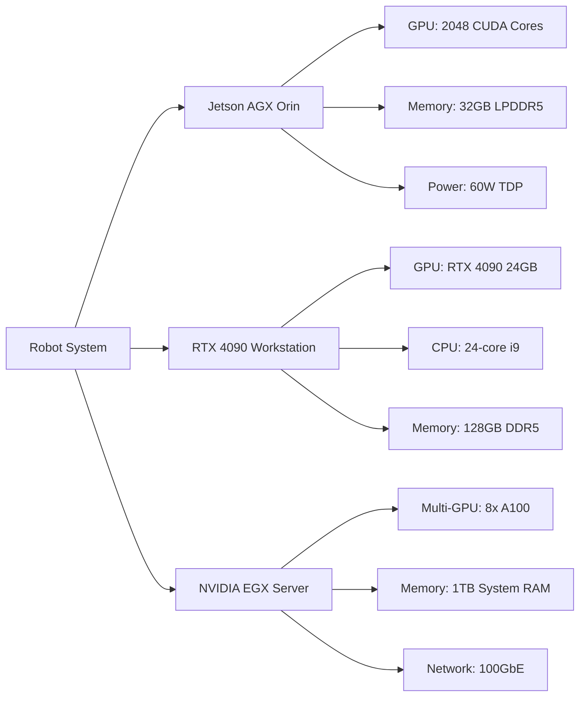

# 3.1.2 Isaac™ Architecture and Components

## Isaac Sim Architecture

The architecture of Isaac Sim is built on NVIDIA's Omniverse platform, which provides a scalable and extensible foundation for photorealistic simulation. The architecture is organized in layers that handle different aspects of the simulation pipeline, from core rendering and physics to ROS integration and extension capabilities.

### Omniverse Foundation Layer

The Omniverse Foundation Layer forms the core of Isaac Sim's architecture, providing essential services that enable the platform's advanced capabilities. This layer includes:

**Universal Scene Description (USD)**: USD serves as the backbone of Isaac Sim's scene representation. Developed by Pixar, USD provides a powerful and extensible format for describing complex 3D scenes. In Isaac Sim, USD enables:

- Hierarchical scene composition with instancing and referencing
- Layer-based composition for complex scene assembly
- Variant sets for different scene configurations
- Extensible schema system for custom object types
- Efficient streaming and level-of-detail management

**RTX Rendering Engine**: The RTX rendering engine leverages NVIDIA's hardware-accelerated ray tracing capabilities to provide photorealistic rendering. Key features include:

- Real-time ray tracing for accurate lighting and shadows
- Global illumination with multiple bounce lighting
- Physically-based materials with accurate light interaction
- Multi-resolution shading for performance optimization
- Variable rate shading for selective detail enhancement

**PhysX Physics Engine**: NVIDIA's PhysX engine provides the physics simulation capabilities that are crucial for realistic robot simulation:

- Rigid body dynamics with collision detection and response
- Soft body and cloth simulation
- Fluid simulation capabilities
- Vehicle dynamics and tire modeling
- Destruction and fracture simulation
- Multi-threaded simulation for performance

### Simulation Layer

The Simulation Layer handles the specific requirements of robotics simulation, including robot models, sensors, and environment interactions.

**Robot Simulation**: This component manages the simulation of robotic systems with high fidelity:

- Articulated body dynamics for complex robot kinematics
- Joint constraints and actuator models
- Contact modeling for robot-environment interaction
- Multi-robot simulation with collision avoidance
- Realistic motor and transmission modeling

**Sensor Simulation**: The sensor simulation system provides realistic modeling of various robot sensors:

- RGB cameras with realistic distortion models
- Depth cameras with noise and accuracy modeling
- LiDAR simulation with configurable parameters
- IMU simulation with bias and noise characteristics
- GPS and other navigation sensors
- Force/torque sensors for manipulation tasks

**Environment Simulation**: This component manages the simulated world in which robots operate:

- Static and dynamic environment objects
- Environmental effects (lighting, weather, etc.)
- Dynamic obstacles and moving objects
- Multi-world simulation capabilities
- Ground truth data generation

### ROS Integration Layer

The ROS Integration Layer provides seamless communication between Isaac Sim and ROS 2 systems:

**ROS 2 Bridge**: The bridge handles message translation and communication:

- Automatic topic and service mapping
- Message type conversion between Isaac Sim and ROS 2
- TF tree synchronization
- Clock synchronization between simulation and ROS nodes
- Lifecycle management for ROS 2 nodes

**Topic Management**: Efficient handling of ROS 2 topics within the simulation:

- Publisher and subscriber management
- Quality of Service (QoS) configuration
- Message serialization and deserialization
- Bandwidth and latency simulation
- Connection state monitoring

### Extension Layer

The Extension Layer allows customization and enhancement of Isaac Sim's capabilities:

**Python Extensions**: Script-based extensions for custom functionality:

- Custom sensor implementations
- Specialized environment generators
- Data processing and analysis tools
- User interface enhancements
- Integration with external tools

**C++ Extensions**: High-performance extensions for computationally intensive tasks:

- Custom physics behaviors
- Advanced rendering effects
- Hardware integration
- Performance-critical algorithms
- Low-level system interfaces

## Isaac ROS Package Structure

Isaac ROS follows a modular package structure that enables developers to use only the components they need while maintaining compatibility with the broader ROS 2 ecosystem. The packages are organized into several categories based on their functionality.

### Core Packages

The core Isaac ROS packages provide fundamental capabilities that are used across multiple applications:

- **isaac_ros_common**: Shared utilities and base classes used by other packages
- **isaac_ros_gxf_extensions**: Extensions to the GXF framework used by Isaac ROS
- **isaac_ros_managed_nh**: Managed node handle utilities for resource management
- **isaac_ros_test**: Testing utilities and frameworks for Isaac ROS packages

### Perception Packages

The perception packages leverage GPU acceleration to provide high-performance processing of sensor data:

- **isaac_ros_image_pipeline**: Hardware-accelerated image processing pipeline
  - Image rectification and calibration
  - Format conversion and resizing
  - Noise filtering and enhancement
  - Camera model handling

- **isaac_ros_dnn_inference**: Deep neural network inference with TensorRT
  - Model loading and optimization
  - TensorRT integration for acceleration
  - Pre and post-processing utilities
  - Batch processing capabilities

- **isaac_ros_visual_slam**: Hardware-accelerated visual SLAM
  - Feature detection and matching
  - Pose estimation and tracking
  - Map building and optimization
  - Loop closure detection

- **isaac_ros_pose_estimation**: Human and object pose estimation
  - 2D and 3D pose detection
  - Multi-person tracking
  - Keypoint detection and tracking
  - Skeletal analysis

- **isaac_ros_apriltag**: GPU-accelerated AprilTag detection
  - High-speed tag detection
  - Pose estimation from tags
  - Multi-tag tracking
  - Custom tag generation

- **isaac_ros_depth_segmentation**: Depth and semantic segmentation
  - Real-time segmentation
  - Instance and semantic labeling
  - Depth map processing
  - Object boundary detection

### Navigation Packages

Navigation packages provide GPU-accelerated algorithms for robot navigation:

- **isaac_ros_occupancy_grid_localizer**: GPU-accelerated occupancy grid localization
- **isaac_ros_nitros**: Nitros data type system for efficient data processing
- **isaac_ros_point_cloud_interfaces**: Point cloud processing interfaces

### Manipulation Packages

Packages focused on robotic manipulation tasks:

- **isaac_ros_manipulator**: Manipulation planning and control
- **isaac_ros_freespace_segmentation**: Free space detection for navigation

### Package Dependency Graph

## Isaac SDK and GEMs

The Isaac SDK and GEMs (GPU-accelerated Embedded Machine Learning libraries) provide the foundational tools and algorithms that power the Isaac ecosystem.

### Isaac SDK Components

The Isaac SDK is built around several core components that provide the infrastructure for robotics applications:

**Codelets**: Codelets are lightweight, reusable components that perform specific functions within the Isaac ecosystem:

- **Lightweight execution units**: Codelets are designed for minimal overhead and maximum efficiency
- **Modular design**: Each codelet performs a specific task and can be combined with others
- **GPU integration**: Codelets can leverage GPU acceleration when available
- **Memory management**: Efficient memory allocation and reuse patterns
- **Real-time capabilities**: Designed for deterministic execution in real-time systems

**Applications**: Applications coordinate multiple codelets to perform complex tasks:

- **Application lifecycle management**: Initialization, execution, and cleanup
- **Resource allocation**: GPU memory, CPU threads, and system resources
- **Inter-codelet communication**: Message passing and data sharing
- **Configuration management**: Parameter loading and validation
- **Monitoring and logging**: Performance and diagnostic information

**Packages**: Packages group related codelets and applications:

- **Functional grouping**: Related functionality is organized in packages
- **Dependency management**: Clear dependencies between packages
- **Build system integration**: Seamless integration with build systems
- **Documentation and examples**: Comprehensive documentation and usage examples
- **Testing frameworks**: Built-in testing capabilities

### Isaac GEMs

Isaac GEMs provide optimized implementations of common robotics algorithms:

**Vision Libraries**: GPU-accelerated computer vision algorithms:

- **Feature detection**: FAST, ORB, SIFT, and other feature detectors
- **Image processing**: Filtering, enhancement, and transformation operations
- **Pattern recognition**: Template matching and pattern detection
- **Optical flow**: Dense and sparse optical flow computation
- **Image segmentation**: Semantic and instance segmentation

**Perception Libraries**: Advanced perception algorithms for robotics:

- **Object detection**: Real-time object detection with neural networks
- **Object tracking**: Multi-object tracking and re-identification
- **Scene understanding**: 3D scene reconstruction and understanding
- **Depth estimation**: Monocular and stereo depth estimation
- **Pose estimation**: 6D pose estimation for objects and humans

**Navigation Libraries**: Algorithms for robot navigation:

- **Path planning**: Global and local path planning algorithms
- **SLAM**: Simultaneous localization and mapping
- **Localization**: Pose estimation and tracking
- **Coverage planning**: Area coverage and exploration algorithms
- **Collision avoidance**: Dynamic obstacle avoidance

**Manipulation Libraries**: Algorithms for robotic manipulation:

- **Grasp planning**: Automatic grasp planning for objects
- **Trajectory generation**: Smooth trajectory planning for manipulators
- **Force control**: Force and impedance control algorithms
- **Visual servoing**: Vision-based control for manipulation
- **Task planning**: High-level manipulation task planning

## Hardware Requirements

The NVIDIA Isaac™ platform leverages GPU acceleration to provide high-performance robotics capabilities. Understanding the hardware requirements is essential for successful deployment.

### Minimum Requirements

| Component | Minimum Specification |
|-----------|----------------------|
| GPU | NVIDIA RTX 3060 (12GB VRAM) or equivalent |
| CPU | 8-core processor (Intel i7 or AMD Ryzen 7) |
| RAM | 32GB system memory |
| Storage | 100GB free disk space (SSD recommended) |
| OS | Ubuntu 22.04 LTS |
| Network | Gigabit Ethernet |
| Display | 1920x1080 display (for simulation interface) |

### Recommended Requirements

| Component | Recommended Specification |
|-----------|---------------------------|
| GPU | NVIDIA RTX 4080 (16GB VRAM) or RTX 4090 (24GB VRAM) |
| CPU | 16-core processor (Intel i9 or AMD Threadripper) |
| RAM | 64GB or more system memory |
| Storage | 500GB+ NVMe SSD |
| OS | Ubuntu 22.04 LTS |
| Network | 10 Gigabit Ethernet for distributed systems |
| Display | 4K display for detailed simulation visualization |

### GPU Acceleration Benefits

The GPU acceleration provided by Isaac™ packages offers significant performance improvements over CPU-only implementations:

**Performance Benchmarks** (RTX 3060 vs RTX 4090):

- **Image Processing**: 5-10x speedup on RTX 4090 vs RTX 3060
- **DNN Inference**: 3-8x speedup depending on model complexity
- **Visual SLAM**: 4-6x speedup for feature detection and tracking
- **Depth Estimation**: 6-12x speedup for neural network-based depth
- **Pose Estimation**: 4-7x speedup for human pose detection

**Real-time Performance**:
- Isaac ROS nodes can process sensor data at 30-60 FPS for most perception tasks
- Visual SLAM can operate in real-time with 10-30 FPS tracking
- DNN inference can achieve 20-50 FPS depending on model complexity
- Multi-sensor fusion operates with minimal latency

## Diagrams

### System Architecture (Detailed Mermaid)

### Package Dependency Graph

### Hardware Configuration Examples

